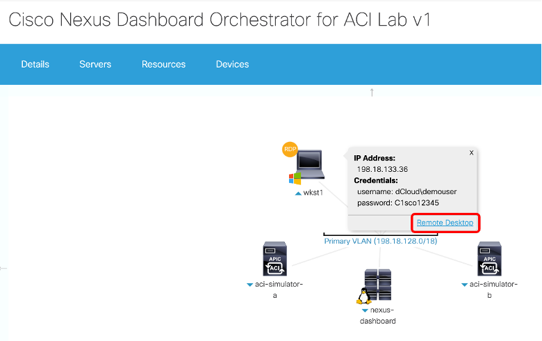

# Welcome to ACI Infrastrucure as Code Hands on Lab

### Introduction

**Terraform** is an open source automation software that is used to manage and operate infrastructure. Terraform is a tool for building, changing, and versioning infrastructure safely and efficiently.
All the Terraform configuration is saved in a data structure format that is treated as code itself, hence the name **infrastructure as code**. This code defines the states that the infrastructure is needed to be in for proper operation. 

In this lab, you will learn how Terraform can be used to define network components using these concepts and simplifying operations of networks.

This lab will walk you through using the newest way to **automate ACI using Terraform**. The benefit of using Terraform, Terraform resources and ACI data sources is, it takes away the need to write and develop custom scripts. The Terraform resources are pre-written blocks of code that perform a specific task. This saves you time from researching API requests, developing code to make the proper API request, and then testing and debugging the code.

### How to connect to lab and Setup Terraform

Step 1: Once the session has been opened, select Details and then use **Anyconnect** to connect to the lab using the specified **host url, login, and password.**

Step 2: Then click on **wkst1** icon and then click on the **Remote Desktop**. Another tab will be opened for the workstation. The workstation is where you will be performing the lab. 

Step 3: Click on the **Centos7-tools1** icon and copy the **IP address, username and password.**

Step 4: Click on the **PuTTY** icon at the bottom of taskbar on **wkst1** window.

Step 5: Enter the IP address of the CentOS and then click **Open**.

Step 6: Enter the **username and password (root/C1sco12345)**

### **Proceed to [Module 1](https://github.com/krishna426426/ACI_Infrastructure_as_Code/blob/main/module1.md)**
