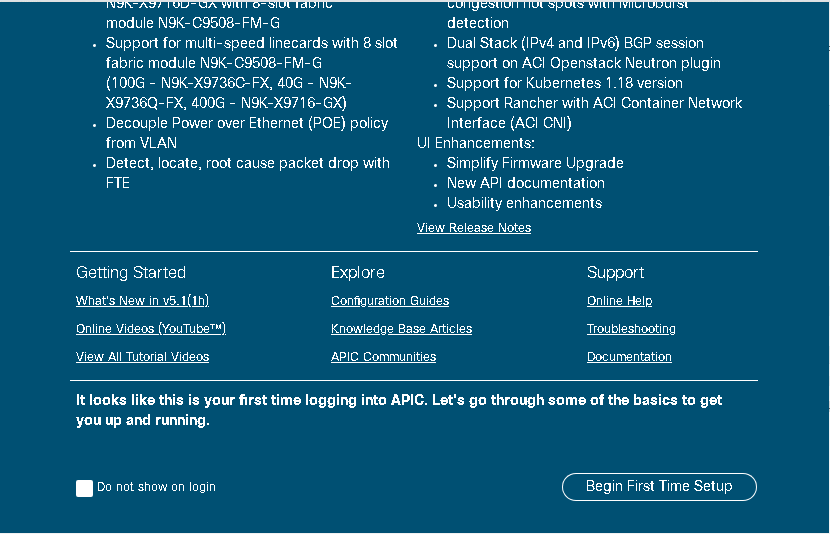

## Module 2: Introduction to the ACI Terraform provider


Now that you have installed Terraform, let's understand what a Terraform provider is.

A Terraform provider is a set of Resources and Data Sources that allow the Terraform binary to interact with a third-party system. You use a Resource to add, modify, or destroy a unit of infrastructure. For the ACI Terraform Provider, those Resources and Data Sources represent the ACI Configuration elements of the Application Policy Infrastructure Controller or APIC.

The first step to start using a Terraform provider like the ACI Terraform provider is to define a provider in your Terraform Plan. A Terraform Plan is the configuration file that describes the providers, resources, and data sources that represent your infrastructure using the HashiCorp Configuration Language (HCL). 

Step 1: Create a new directory **aci_terraform**.

```
$ mkdir aci_terraform
$ cd aci_terraform/ 
```


Step 2; Create a file using **vi** and name it as **main.tf** and enter the following code to the main.tf

> Note: Enter i to paste the copied code

> Note: After copied, Enter ESC to exit edit mode for vi, and then type :wq! To save and quit.


```
$ vi main.tf

terraform {
  required_providers {
    aci = {
      source = "CiscoDevNet/aci"
    }
  }
}

# Configure the provider with your Cisco APIC credentials.
provider "aci" {
  # APIC Username
  username = var.user.username
  # APIC Password
  password = var.user.password
  # APIC URL
  url      = var.user.url
  insecure = true
}
```

Step 3: Type in **cat main.tf** to verify the file contents were copied and saved correctly.


You can see that the first part of the **main.tf** file points to the source of the provider. 

```
terraform {
  required_providers {
    aci = {
      source = "CiscoDevNet/aci"
```

The next part contains the definition of the ACI provider and the necessary parameters needed to instantiate it.

In this example of the ACI provider configuration, the username, password and URL used to establish a connection the APIC API.

Step 4: Return to the dCloud tab and click on the **aci-simulator-a** to get the **username, password and IP address** of the APIC.


Step 5: The variables such as **var.user.username, var.user.password and var.user.url** are defined in the variable.tf as follows. Create another file **variable.tf** using vi. Enter i to paste the following copied code.

```
$ vi variable.tf

variable "user" {
  description = "Login information"
  type        = map
  default     = {
    username = "admin"
    password = "C1sco12345"
    url      = "https://198.18.133.200"
  }
}
```

> Note: Enter ESC to exit edit mode for vi, and then type :wq! to save and quit.


Step 6: Type in  **cat variable.tf** to verify the file contents were copied and saved correctly.


## Initializing the Terraform Plan

Make sure you are in the aci_terraform directory containing the main.tf file. 

Step 1: To initialize your plan, execute the **terraform init** command.

```
[root@centos7-tools1 aci_terraform]# ls
main.tf  variable.tf

[root@centos7-tools1 aci_terraform]# terraform init

Initializing the backend...

Initializing provider plugins...
- Finding latest version of ciscodevnet/aci...
- Installing ciscodevnet/aci v2.5.2...
- Installed ciscodevnet/aci v2.5.2 (signed by a HashiCorp partner, key ID 433649E2C56309DE)

Partner and community providers are signed by their developers.
If you'd like to know more about provider signing, you can read about it here:
https://www.terraform.io/docs/cli/plugins/signing.html

Terraform has created a lock file .terraform.lock.hcl to record the provider
selections it made above. Include this file in your version control repository
so that Terraform can guarantee to make the same selections by default when
you run "terraform init" in the future.

Terraform has been successfully initialized!
```


Step 2: You may now begin working with Terraform. Try running **terraform plan** to see any changes that are required for your infrastructure. All Terraform commands should now work.

```
[root@centos7-tools1 aci_terraform]# terraform plan

No changes. Your infrastructure matches the configuration.

Terraform has compared your real infrastructure against your configuration and found no differences, so no
changes are needed.
[root@centos7-tools1 Module2-Intro]#
[root@centos7-tools1 Module2-Intro]#
[root@centos7-tools1 Module2-Intro]# ls -a
.  ..  main.tf  .terraform  .terraform.lock.hcl  variable.tf
```


You have now initialized the plan and Terraform created a .terraform directory in the current folder. This directory contains the binary executable of the ACI Terraform provider.

## Adding the ACI resources in Terraform Plan

The ACI Tenant resource supports a wide range of ACI Tenant configurations. However, this Lab introduces the core resource needed for managing Tenant Networks, Policies, and EPGs. This Lab covers the purpose of each resource, unique parameters, and expected output. At the end of this module, you create and use a Terraform plan that ensures a Tenant, VRF, BD, EPGs, Subnets, AP, contracts and filter configuration exists.

Step 1: Add the **aci_tenant** resource to the **main.tf** at the end of the file.
Enter i to insert the following code at the end and then hit ESC and type :wq! to save and exit.

```
# Define an ACI Tenant Resource.
resource "aci_tenant" "terraform_tenant" {
    name        =  var.tenant
    description = "This tenant is created by terraform"
}
```
It looks like as follows:

```
[root@centos7-tools1 Module2-Intro]# vi main.tf
terraform {
  required_providers {
    aci = {
      source = "CiscoDevNet/aci"
    }
  }
}

# Configure the provider with your Cisco APIC credentials.
provider "aci" {
  # APIC Username
  username = var.user.username
  # APIC Password
  password = var.user.password
  # APIC URL
  url      = var.user.url
  insecure = true
}

# Define an ACI Tenant Resource.
resource "aci_tenant" "terraform_tenant" {
    name        =  var.tenant
    description = "This tenant is created by terraform"
}
```

### Understanding the code:

The **aci_tenant** resource is used to manage Tenants on the APIC next to the resource, **terraform_tenant** is the name of the variable that contains the representation of this instance of the resource.

> **Name**: Name of the Tenant that you want to manage or retrieve configurations from the APIC

> **Description**: Description of the Tenant that allows you to describe what this tenant is used.

Step 2: Enter the tenant value in **variable.tf**

```
variable "tenant" {
    type    = string
    default = "terraform_tenant"
}

```

Step 3: Type in **cat variable.tf** to verify the file contents were copied and saved correctly.


Step 4: Execute terraform plan

```
[root@centos7-tools1 Module2-Intro]# terraform plan

Terraform used the selected providers to generate the following execution plan. Resource actions are indicated
with the following symbols:
  + create

Terraform will perform the following actions:

  # aci_tenant.terraform_tenant will be created
  + resource "aci_tenant" "terraform_tenant" {
      + annotation                    = "orchestrator:terraform"
      + description                   = "This tenant is created by terraform"
      + id                            = (known after apply)
      + name                          = "terraform_tenant"
      + name_alias                    = (known after apply)
      + relation_fv_rs_tenant_mon_pol = (known after apply)
    }

Plan: 1 to add, 0 to change, 0 to destroy.

────────────────────────────────────────────────────────────────────────────────────────────────────────────────

Note: You didn't use the -out option to save this plan, so Terraform can't guarantee to take exactly these
actions if you run "terraform apply" now.
```

You can see that Terraform details what action is going to be performed when it will be applying this plan. In this case, this plan creates a new tenant called terraform_tenant and the description.


Step 5: Next you apply the plan, and part of the plan is to create a tenant in the APIC. You have to confirm the plan before it runs.

Execute the **terraform apply**.

```
[root@centos7-tools1 Module2-Intro]# terraform apply

Terraform used the selected providers to generate the following execution plan. Resource actions are indicated
with the following symbols:
  + create

Terraform will perform the following actions:

  # aci_tenant.terraform_tenant will be created
  + resource "aci_tenant" "terraform_tenant" {
      + annotation                    = "orchestrator:terraform"
      + description                   = "This tenant is created by terraform"
      + id                            = (known after apply)
      + name                          = "terraform_tenant"
      + name_alias                    = (known after apply)
      + relation_fv_rs_tenant_mon_pol = (known after apply)
    }

Plan: 1 to add, 0 to change, 0 to destroy.

Do you want to perform these actions?
  Terraform will perform the actions described above.
  Only 'yes' will be accepted to approve.

  Enter a value:
```

Step 6: The terraform apply displays the terraform plan output and asks you to confirm by type yes and press enter.  Type in **yes**.

```
Enter a value: yes

aci_tenant.terraform_tenant: Creating...
aci_tenant.terraform_tenant: Creation complete after 3s [id=uni/tn-terraform_tenant]

Apply complete! Resources: 1 added, 0 changed, 0 destroyed.
```

The result shows that you created a new tenant and you can also see that Terraform created a state file terraform.tfstate in the directory:

```
[root@centos7-tools1 Module2-Intro]# ls -l
total 16
-rw-r--r--. 1 root root 498 Oct 13 19:26 main.tf
-rw-r--r--. 1 root root 896 Oct 13 19:38 terraform.tfstate
-rw-r--r--. 1 root root 178 Oct 13 19:38 terraform.tfstate.backup
-rw-r--r--. 1 root root 190 Oct 13 19:11 variable.tf
```

Step 7: Login to the APIC to validate your new Tenant has been created. Open the chrome browser from the toolbar in the workstation. Enter **https://198.18.133.200 and login with admin/C1sco12345**

Step 8: You can Bypass the Begin First Time Setup screen by clicking on **Begin First Time Setup. **



Step 9: And then clicking on **Close**. 


Step 10: Access the **Tenants** from the home page.


Step 11: You can view the newly created tenant** (terraform_tenant)**.


### Additional ACI tenant network resources 

There are several Terraform resources related to Tenant networking constructs, but you focus on the three necessaries for providing an application with network connectivity.

•	aci_vrf

•	aci\_bridge_domain

•	aci_subnet

Step 1: Open the **main.tf** using vi. Enter **i** and add the following code at the **end of the file** and **enter ESC and then type :wq!** to save and exit the vi.

```
    # Define an ACI Tenant VRF Resource.
    resource "aci_vrf" "terraform_vrf" {
        tenant_dn   = aci_tenant.terraform_tenant.id
        description = "VRF Created Using Terraform"
        name        = var.vrf
    }

    # Define an ACI Tenant BD Resource
    resource "aci_bridge_domain" "terraform_bd" {
        tenant_dn          = aci_tenant.terraform_tenant.id
        relation_fv_rs_ctx = aci_vrf.terraform_vrf.id
        description        = "BD Created Using Terraform"
        name               = var.bd
    }


      # Define an ACI Tenant BD Subnet Resource.
      resource "aci_subnet" "terraform_bd_subnet" {
          parent_dn   = aci_bridge_domain.terraform_bd.id
          description = "Subnet Created Using Terraform"
          ip          = var.subnet
          scope       = ["public"]
    }
```

### Understanding the code:


The **aci_vrf** resource is used to manage Tenant VRFs on the APIC. This resource has some key parameters to be aware of:

> •	**name**: The name of the new VRF.

> •	**tenant_dn**: The distinguished name of the parent Tenant of this VRF.

The **aci_bd** resource is used to manage Bridge Domains. This resource has several parameters; here are the more important ones:

> •	**name**: The name of the Bridge Domain.

> •	**tenant_dn**: The distinguished name of the parent Tenant of this BD.
 
> •	**relation_fv_rs_ctx**: The distinguished name of the of the VRF which Subnets associated to the Bridge Domain should belong to.

The **aci_subnet** resource is used to manage subnets that belong to a Bridge Domain. Since Subnets are a child object of a Bridge Domain, the parent_dn parameter is used in this module. Here are the more common parameters:

> •	**parent_dn**: The distinguished name of the of the parent BD of the Subnet.

> •	**ip**: The gateway address with subnet mask for hosts on the Subnet.
 
> •	**scope**: Determines if the Subnet should be advertised externally (public), kept private to the VRF (private), or shared with other Tenants (shared).


The complete list of configuration options is available in the [documentation](https://registry.terraform.io/providers/CiscoDevNet/aci/latest/docs/resources/vrf)

Step 2: Enter the new vrf, bd and subnet variables in the variable.tf file. Open the **variable.tf** using vi. Enter i and add the following code at the end of the file.and enter ESC and then type :wq! to save and exit the vi.

```
    variable "vrf" {
        type    = string
        default = "prod_vrf"
    }
    variable "bd" {
        type    = string
        default = "prod_bd"
    }
    variable "subnet" {
        type    = string
        default = "10.10.101.1/24"
    }
```

Step 3: Execute **terraform plan** and you can observe 3 actions need to be added.

```
[root@centos7-tools1 Module2-Intro]# terraform plan
aci_tenant.terraform_tenant: Refreshing state... [id=uni/tn-terraform_tenant]

Terraform used the selected providers to generate the following execution plan. Resource actions are indicated
with the following symbols:
  + create

Terraform will perform the following actions:

  # aci_bridge_domain.terraform_bd will be created
  + resource "aci_bridge_domain" "terraform_bd" {
      + annotation                  = "orchestrator:terraform"
      + arp_flood                   = (known after apply)
      + bridge_domain_type          = (known after apply)
      + description                 = "BD Created Using Terraform"
      + ep_clear                    = (known after apply)
      + ep_move_detect_mode         = (known after apply)
      + host_based_routing          = (known after apply)
      + id                          = (known after apply)
      + intersite_bum_traffic_allow = (known after apply)
      + intersite_l2_stretch        = (known after apply)
      + ip_learning                 = (known after apply)
      + ipv6_mcast_allow            = (known after apply)
      + limit_ip_learn_to_subnets   = (known after apply)
      + ll_addr                     = (known after apply)
      + mac                         = (known after apply)
      + mcast_allow                 = (known after apply)
      + multi_dst_pkt_act           = (known after apply)
      + name                        = "prod_bd"


.
.
.
.

Plan: 3 to add, 0 to change, 0 to destroy.

────────────────────────────────────────────────────────────────────────────────────────────────────────────────

Note: You didn't use the -out option to save this plan, so Terraform can't guarantee to take exactly these
actions if you run "terraform apply" now.
[root@centos7-tools1 Module2-Intro]#
```

Step 4: Now you can run the **terraform apply** command

Step 5: The terraform apply displays the terraform plan output and asks you to confirm by type yes and press enter.  Type in **yes**.

```
[root@centos7-tools1 Module2-Intro]# terraform apply
aci_tenant.terraform_tenant: Refreshing state... [id=uni/tn-terraform_tenant]

Terraform used the selected providers to generate the following execution plan. Resource actions are indicated
with the following symbols:
  + create


Plan: 3 to add, 0 to change, 0 to destroy.

Do you want to perform these actions?
  Terraform will perform the actions described above.
  Only 'yes' will be accepted to approve.

  Enter a value: yes

aci_vrf.terraform_vrf: Creating...
aci_vrf.terraform_vrf: Creation complete after 2s [id=uni/tn-terraform_tenant/ctx-prod_vrf]
aci_bridge_domain.terraform_bd: Creating...
aci_bridge_domain.terraform_bd: Creation complete after 1s [id=uni/tn-terraform_tenant/BD-prod_bd]
aci_subnet.terraform_bd_subnet: Creating...
aci_subnet.terraform_bd_subnet: Creation complete after 2s [id=uni/tn-terraform_tenant/BD-prod_bd/subnet-[10.10.101.1/24]]

Apply complete! Resources: 3 added, 0 changed, 0 destroyed.
[root@centos7-tools1 Module2-Intro]#
```

Step 6: Go back to APIC and check the VRF, BD and subnet has configured.  Click on **Tenants**.

Step 7: Double-click on **terraform_tenant**


Step 8: Click on **Networking**. You can see the newly created VRF and BD


Step 9: You can click on the **Bridge Domain** (prod_bd) on the left-hand side to see the associated Subnet


### Proceed to [Module 3](https://github.com/krishna426426/ACI_Infrastructure_as_Code/blob/main/module3.md)
