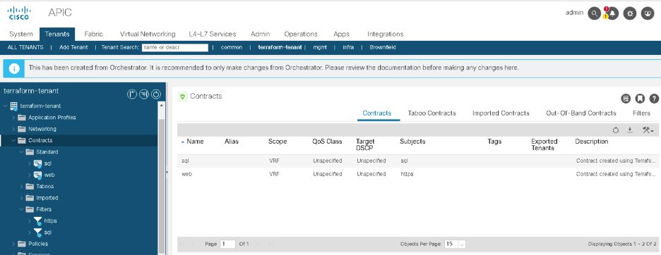

# Module 3: Add ACI policies and contracts using Terraform

In this module you are going to add the four resources that build the Policy for the Application's Endpoint groups are:

> aci_filter
 
> aci\_filter_entry
 
> aci_contract

> aci\_contract_subject


Step 1: Add the **aci\_filter, aci\_filter\_entry, aci\_contract and aci\_contract_subject** resources to the **main.tf** file at the end of existing code.

> Note: Enter vi main.tf and copy the following code. Hit ESC and :wq! to save the file.


```
   # Define an ACI filter Resource.
   resource "aci_filter" "terraform_filter" {
       for_each    = var.filters
       tenant_dn   = aci_tenant.terraform_tenant.id
       description = "This is filter ${each.key} created by terraform"
       name        = each.value.filter
   }

   # Define an ACI filter entry resource.
   resource "aci_filter_entry" "terraform_filter_entry" {
       for_each      = var.filters
       filter_dn     = aci_filter.terraform_filter[each.key].id
       name          = each.value.entry
       ether_t       = "ipv4"
       prot          = each.value.protocol
       d_from_port   = each.value.port
       d_to_port     = each.value.port
   }

    # Define an ACI Contract Resource.
    resource "aci_contract" "terraform_contract" {
        for_each      = var.contracts
        tenant_dn     = aci_tenant.terraform_tenant.id
        name          = each.value.contract
        description   = "Contract created using Terraform"
        scope         = "context"
    }

    # Define an ACI Contract Subject Resource.
    resource "aci_contract_subject" "terraform_contract_subject" {
        for_each                      = var.contracts
        contract_dn                   = aci_contract.terraform_contract[each.key].id
        name                          = each.value.subject
        relation_vz_rs_subj_filt_att  = [aci_filter.terraform_filter[each.value.filter].id]
    }
```

## Understanding the code:

The **aci_filter** resource is used to manage filter objects on the APIC, it has the following attributes:

> **name**: The name of the filter.

> **tenant_dn**: The distinguished name to reference the parent Tenant of this filter.

The **aci\_filter_entry** is used to manage the Network Protocol entries that are associated with the filters and some of the resource options are:
> **name**: The name of the filter entry.

> **filter_dn**: The DN to reference the parent filter

> **ether_t**: Sets the Ethernet type for the object; "ip" is most common option.

> **Prot**: Available when the ether_type is "ip" and used to determine the IP Protocol of the object. The most common options are "tcp", "udp", and "icmp".

> **d\_from_port**: Available for TCP and UDP filter entries, and used to set the starting port of the destination port range.

> **d\_to_port**: Available for TCP and UDP filter Entries, and used to set the ending port of the destination port range.


Note: These resources use a resource meta-arguments called for_each, that allows the provider to loop over a map and create multiple resources.

The **aci\_contract** resource is used to manage contracts and the aci_contract_subject resource is used primarily to manage what filters are associated with a Contract.

> **name**: The name of the contract object

> **scope**: Determines the scope of the contract. The options are "context", "application-profile", "tenant", and "global". The contract's scope determines how the contract is provided and consumed by the associated EPGs, and is a way to use contracts efficiently.
"context" is the same as VRF in contract scope.

> **relation\_vz_rs\_subj\_filt\_att**: A list of DNs of filters to use to create a relationship between filters and the subject.

> **rev\_flt_ports**: Determines if the ACI Fabric should reverse the ports to allow return traffic back to the originating host, since the contracts are stateless. This argument is not shown in the plan.


Step 2: Add the filter and contract variables to the variable.tf file at the end of the existing code.

```
variable "filters" {
   description = "Create filters with these names and ports"
   type        = map
   default     = {
     filter_https = {
       filter   = "https",
       entry    = "https",
       protocol = "tcp",
       port     = "443"
     },
     filter_sql = {
       filter   = "sql",
       entry    = "sql",
       protocol = "tcp",
       port     = "1433"
     }
   }
 }

variable "contracts" {
   description = "Create contracts with these filters"
   type        = map
   default     = {
     contract_web = {
       contract = "web",
       subject  = "https",
       filter   = "filter_https"
     },
     contract_sql = {
       contract = "sql",
       subject  = "sql",
       filter   = "filter_sql"
     }
   }
 }
```


Step 3: Now that you are familiar with the contract and filter resources in the Terraform plan, it is time to apply this plan. In the previous exercises, when you used terraform apply that required confirmation before applying the configuration. It is possible to bypass this confirmation by using the **-auto-approve** CLI argument.

```
[root@centos7-tools1 aci_terraform]# terraform apply -auto-approve
aci_tenant.terraform_tenant: Refreshing state... [id=uni/tn-terraform-tenant]
aci_vrf.terraform_vrf: Refreshing state... [id=uni/tn-terraform-tenant/ctx-prod_vrf]
aci_bridge_domain.terraform_bd: Refreshing state... [id=uni/tn-terraform-tenant/BD-prod_bd]
aci_subnet.terraform_bd_subnet: Refreshing state... [id=uni/tn-terraform-tenant/BD-prod_bd/subnet-[10.10.101.1/24]]

Terraform used the selected providers to generate the following execution plan.
Resource actions are indicated with the following symbols:
  + create

Terraform will perform the following actions:

.
.
.
.
.
aci_filter_entry.terraform_filter_entry["filter_sql"]: Creation complete after 1s [id=uni/tn-terraform-tenant/flt-sql/e-sql]
aci_contract_subject.terraform_contract_subject["contract_sql"]: Creation complete after 2s [id=uni/tn-terraform-tenant/brc-sql/subj-sql]
aci_contract_subject.terraform_contract_subject["contract_web"]: Creation complete after 2s [id=uni/tn-terraform-tenant/brc-web/subj-https]

Apply complete! Resources: 8 added, 0 changed, 0 destroyed.
```


Step 4: Navigate back to your Tenant in the **APIC GUI**, and follow these steps to validate they exist:

•	Expand the "contracts" folder.

•	Expand the "Standard" folder to see the contracts that you created.



### Proceed to [Module 4](https://github.com/krishna426426/ACI_Infrastructure_as_Code/blob/main/module4.md)