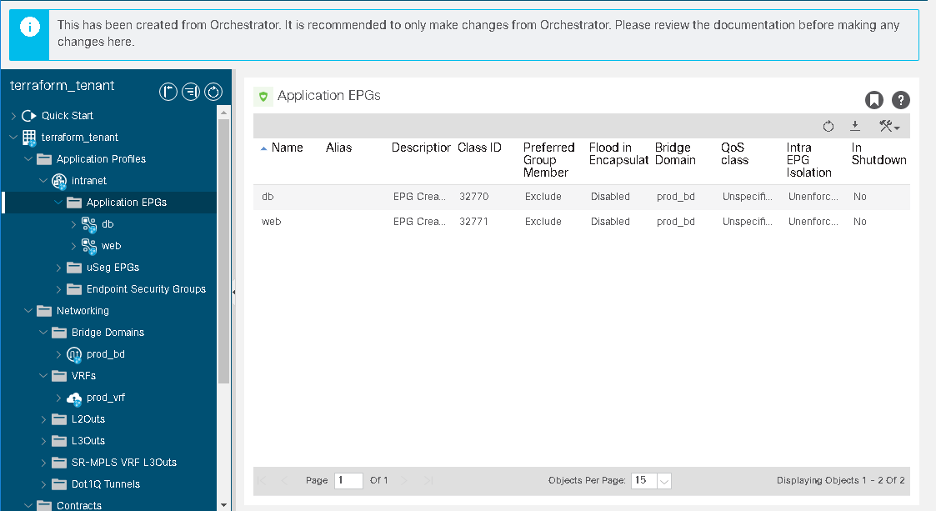
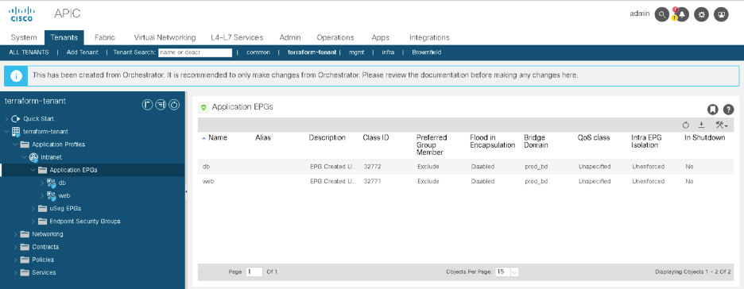

# Module 4: Add ACI application profile resources using Terraform

In this module you are going to add four resources that needed to build an application profile with EPGs:

> aci\_application_profile

> aci\_application_epg

> aci\_epg\_to_domain

> aci\_epg\_to_contract


Step 1.	 Add the **aci\_application\_profile, aci\_application\_epg, aci\_epg\_to\_domain and aci\_epg\_to\_contract** resources to the **main.tf** file at the end of existing code.

```
   # Define an ACI Application Profile Resource.
   resource "aci_application_profile" "terraform_ap" {
     tenant_dn  = aci_tenant.terraform_tenant.id
     name       = var.ap
     description = "App Profile Created Using Terraform"
   }

   resource "aci_application_epg" "terraform_epg" {
       for_each                = var.epgs
       application_profile_dn  = aci_application_profile.terraform_ap.id
       name                    = each.value.epg
       relation_fv_rs_bd       = aci_bridge_domain.terraform_bd.id
       description             = "EPG Created Using Terraform"
   }

   # Associate the EPG Resources with a VMM Domain.
   resource "aci_epg_to_domain" "terraform_epg_domain" {
       for_each              = var.epgs
       application_epg_dn    = aci_application_epg.terraform_epg[each.key].id
       tdn   = "uni/vmmp-VMware/dom-aci_terraform_lab"
   }


   # Associate the EPGs with the contracts
   resource "aci_epg_to_contract" "terraform_epg_contract" {
       for_each           = var.epg_contracts
       application_epg_dn = aci_application_epg.terraform_epg[each.value.epg].id
       contract_dn        = aci_contract.terraform_contract[each.value.contract].id
       contract_type      = each.value.contract_type
   }
```

## Understanding the code:

Managing application profiles is done using the **aci\_application_profile **resource.

> **name**: is used to ensure an application profile exists 

> **tenant_dn**: is used to specify in which Tenant it exists.


The **aci\_application_epg** resource is used to manage an application's Endpoint groups

> **application\_profile_dn**: The distinguished name of the Application Profile that the EPG belongs to.

> **name**: The name of the EPG.

> **relation\_fv_rs\_bd**: The distinguished name of the bridge domain which hosts belonging to the EPG should be associated with. This determines what broadcast domain the hosts are connected to, and what IP subnets are available for them to use.

The **aci\_epg\_to_domain** resource is used to manage EPG to Domain Bindings (VMM and physical). Here are the components of the resource:

> **application\_epg_dn**: The distinguished name of the EPG to associate to the domain.

> **tdn**: The DN of the VMM or Physical domain to associate with the EPG.

The **aci\_epg\_to_contract** resource is used to manage the contracts that are associated with the EPG. This resource uses the following arguments:

> **application\_epg_dn**: The distinguished name of the EPG to associate with the contract.

> **contract_dn**: The distinguished imgname of the contract to be associated with the EPG.

> **contract_type**: This argument is used to indicate if the EPG is a provider or consumer of the contract.

Step 2: Add the ap and **epg_contract** variables to the **variable.tf** file at the end of the existing code.

```
variable "ap" {
    description = "Create application profile"
    type        = string
    default     = "intranet"
}
 
  variable "epgs" {
       description = "Create epg"
       type        = map
       default     = {
           web_epg = {
               epg   = "web",
               bd    = "prod_bd",
               encap = "21"
           },
           db_epg = {
               epg   = "db",
               bd    = "prod_bd",
               encap = "22"
           }
       }
   }
   variable "epg_contracts" {
       description = "epg contracts"
       type        = map
       default     = {
           terraform_one = {
               epg           = "web_epg",
               contract      = "contract_web",
               contract_type = "provider" 
           },
           terraform_two = {
               epg           = "web_epg",
               contract      = "contract_sql",
               contract_type = "consumer" 
           },
           terraform_three = {
               epg           = "db_epg",
               contract      = "contract_sql",
               contract_type = "provider" 
           }
       }
   }
```

Step 3: It is time to apply this plan. Execute **terraform apply** by using the **-auto-approve** CLI argument. Type in **terraform apply -auto-approve**

```
[root@centos7-tools1 aci_terraform]# terraform apply -auto-approve
aci_tenant.terraform_tenant: Refreshing state... [id=uni/tn-terraform-tenant]
aci_filter.terraform_filter["filter_sql"]: Refreshing state... [id=uni/tn-terraform-tenant/flt-sql]
aci_contract.terraform_contract["contract_sql"]: Refreshing state... [id=uni/tn-terraform-tenant/brc-sql]
aci_filter.terraform_filter["filter_https"]: Refreshing state... [id=uni/tn-terraform-tenant/flt-https]
aci_contract.terraform_contract["contract_web"]: Refreshing state... [id=uni/tn-terraform-tenant/brc-web]
.
.
.
.
.
terraform-tenant/ap-intranet/epg-db/rsprov-sql]
aci_epg_to_domain.terraform_epg_domain["db_epg"]: Creation complete after 3s [id=uni/tn-terraform-tenant/ap-intranet/epg-db/rsdomAtt-[uni/vmmp-VMware/dom-aci_terraform_lab]]
aci_epg_to_domain.terraform_epg_domain["web_epg"]: Creation complete after 3s [id=uni/tn-terraform-tenant/ap-intranet/epg-web/rsdomAtt-[uni/vmmp-VMware/dom-aci_terraform_lab]]

Apply complete! Resources: 8 added, 0 changed, 0 destroyed.
```

Step 4: Navigate back to your **Tenant** in the **APIC GUI**, and follow these steps to validate they exist:

•	Expand the **Application Profiles** folder.

•	Expand **intranet**.

•	Expand the **Application EPGs** folder to see the EPGs you created.





### Proceed to Module 5