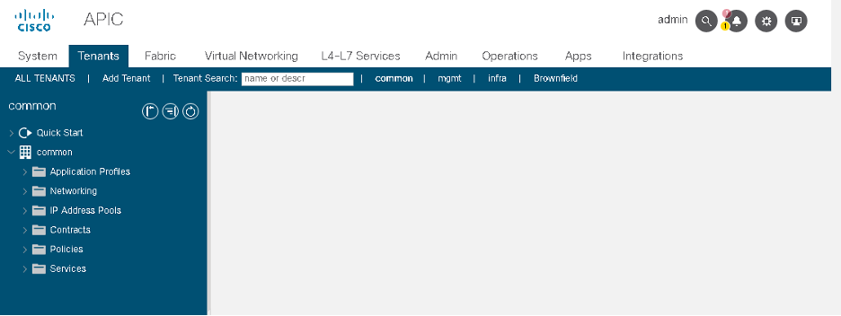

# Module 5: Destroy the plan using Terraform

To clean up the configurations for this Lab, you can destroy the plan to make a **DELETE** request for your Tenant. 

Make sure you are in the same directory that containing the **main.tf** as discussed in the previous modules.

Step 1: Next, you can run the **terraform destroy** command.  Type yes when requested to enter a value.

```
[root@centos7-tools1 aci_terraform]# terraform destroy
aci_tenant.terraform_tenant: Refreshing state... [id=uni/tn-terraform-tenant]
aci_contract.terraform_contract["contract_sql"]: Refreshing state... [id=uni/tn-terraform-tenant/brc-sql]
.
.
.
.
.
.
.
.
      - pc_enf_pref            = "enforced" -> null
      - tenant_dn              = "uni/tn-terraform-tenant" -> null
    }

Plan: 0 to add, 0 to change, 20 to destroy.
.
.
.
.
.
aci_application_profile.terraform_ap: Destroying... [id=uni/tn-terraform-tenant/ap-intranet]
aci_application_profile.terraform_ap: Destruction complete after 0s
aci_bridge_domain.terraform_bd: Destruction complete after 0s
aci_vrf.terraform_vrf: Destroying... [id=uni/tn-terraform-tenant/ctx-prod_vrf]
aci_vrf.terraform_vrf: Destruction complete after 0s
aci_tenant.terraform_tenant: Destroying... [id=uni/tn-terraform-tenant]
aci_tenant.terraform_tenant: Destruction complete after 0s

Destroy complete! Resources: 20 destroyed.
```

Step 2: Check the APIC terraform-tenant and all associated config should be deleted.



Great job, excellent work! You now have a solid understanding of how the ACI Terraform resources can be used to manage your entire **ACI environment** "**as Code**".

